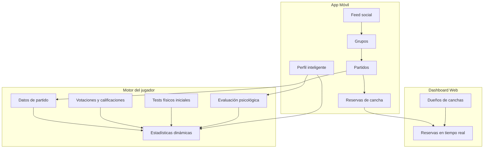
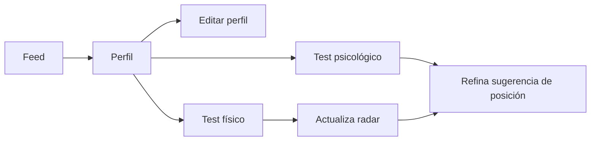

# Elite Forge — Documentación del Producto

## ¿Qué es Elite Forge?

**Elite Forge** es una aplicación móvil de fútbol que combina:

- Un **perfil de jugador inteligente** que evoluciona con cada partido.
- Una **red social deportiva** con feed, amistades y grupos.
- **Organización de partidos** con invitaciones, cupos y formatos configurables.
- **Reservas de canchas** conectadas a un dashboard web para dueños de instalaciones.

El repositorio `EF` contiene el monorepo técnico (mobile, backend, infraestructura) que soporta esta plataforma.

---

## Logo e identidad de marca


### Ubicación del asset (reutilizable)

| Ubicación | Uso |
|-----------|-----|
| `docs/assets/elite-forge-logo.png` | **Fuente oficial** del repositorio y documentación |
| `apps/mobile/assets/images/elite-forge-logo.png` | App móvil (importado por `EliteForgeLogo`) |

En código React Native:

```tsx
import { EliteForgeLogo } from "@/components/ui"

<EliteForgeLogo />
```

### Composición del logo (versión actual)

| Elemento | Descripción | Color |
|----------|-------------|-------|
| Fondo | **Transparente** (sin color de fondo en el PNG) | — |
| Barra superior | Pieza tipo yunque / martillo con detalles geométricos | Verde Esmeralda `#00CEC8` |
| Escudo / yunque | Franjas verticales centradas que convergen en punta inferior | Centro `#00CEC8`, laterales gris |
| Balón central | Balón de fútbol con paneles definidos | Gris + negro |
| Anillo dinámico | Espiral de energía alrededor del balón | Naranja Oscuro `#FF8C00` |
| Tipografía **ELITE** | Nombre principal, mayúsculas, estilo futurista | Verde Esmeralda `#00CEC8` |
| Tipografía **FORGE** | Subtítulo bajo ELITE | Gris medio |

### Estilo visual

Estética **futurista e industrial** que fusiona el concepto de *forja* (yunque, metal, energía) con el fútbol (balón, dinamismo). Diseño vertical y simétrico, pensado para fondos oscuros — idealmente **Gris Carbón `#424242`**.

> **Formato del asset:** PNG con canal alpha (fondo transparente). Si al adjuntar el logo en el chat o exportarlo desde ciertas herramientas el archivo pierde transparencia, el fondo puede aplanarse a negro y verse como un recuadro en la app. El asset oficial en `docs/assets/` conserva transparencia real.

---

## Visión general del producto



---

## Módulos funcionales

### 1. Perfil de jugador inteligente

El perfil es el núcleo de Elite Forge. Aprende y evoluciona con el tiempo.

#### Estado en la app móvil (rama `Dev-David`)

| Funcionalidad | Estado | Notas |
|---------------|--------|-------|
| Pantalla de perfil | **Implementado** | Acceso desde Feed (avatar / drawer) |
| Edición de datos personales | **Implementado** | Nombre, apodo, email, edad, bio |
| Foto de perfil (galería) | **Implementado** | Persistencia local en el dispositivo |
| Tag ID | **Implementado** | Derivado del email de sesión |
| Radar de 6 estadísticas | **Implementado** | SVG; se completa al hacer tests |
| Tests físicos in-app | **Implementado** | 6 tests, medición en la app, 1×/mes |
| Evaluación psicológica | **Implementado** | 10 escenarios, 1×/mes |
| Sugerencia de posición | **Implementado** | 7 posiciones; físico + mental |
| Posición favorita | **Implementado** | El jugador puede fijarla manualmente |
| Grupos / partidos / reservas en perfil | **Próximamente** | Accesos stub con aviso |
| Evolución por partidos reales | **Pendiente** | Requiere backend y partidos |
| Privacidad granular | **Pendiente** | — |
| Sincronización en nube | **Pendiente** | Datos locales (MMKV) por ahora |

> Detalle técnico: [FRONTEND.md](./FRONTEND.md) — sección *Pantalla Perfil*.

#### Datos visibles en el perfil

| Campo | Descripción | App móvil |
|-------|-------------|-----------|
| Foto | Avatar del jugador | Galería + almacenamiento local |
| Nombre | Nombre completo o display name | Editable |
| Apodo | Identificador corto (@) | Editable |
| Posición | Favorita del jugador o sugerida por el sistema | 7 roles de fútbol |
| Tag ID | Identificador único para agregar amigos | Visible en header |
| Sobre mí | Edad y biografía | Tarjeta personal |
| Estadísticas | Radar de 6 ejes + promedio | Clicables → test correspondiente |
| Evaluación psicológica | Teamwork + Mindset | Gráfico de arcos + puntajes |
| Sugerencia de posición | Inferida por stats y mentalidad | Tarjeta con confianza |
| Grupos | Sección compacta con grupos a los que pertenece | Próximamente |
| Partidos recientes | Últimos partidos jugados | Próximamente |
| Reservas | Canchas reservadas vinculadas a partidos | Próximamente |

#### Motor de estadísticas

**Visión del producto**

1. **Estadísticas iniciales** — Generadas por **tests físicos** al registrarse o al repetirlos.
2. **Crecimiento real** — Basado en el desempeño en partidos: goles, pases, votaciones, calificaciones de otros jugadores y métricas del partido.
3. **Evolución** — Las estadísticas **suben o bajan** según el rendimiento sostenido.

**Implementado hoy (mobile)**

- Línea base física vía **6 tests** con puntuación 0–100.
- **Evaluación psicológica** (teamwork, mindset) que refina la **sugerencia de posición** (peso ~28% mental / ~72% físico).
- Sin datos de partidos ni votaciones aún — el radar refleja solo lo medido en tests.

#### Las seis estadísticas y sus tests

| Estadística | Test asociado | Medición in-app |
|-------------|---------------|-----------------|
| **Ataque** | 10 tiros desde 16 m | Contador goles / fallos |
| **Defensa** | Control y recuperación | Rúbrica evaluativa |
| **Resistencia** | Beep test | Simulador de niveles |
| **Velocidad** | Sprint 30 m | Cronómetro |
| **Pases** | Loughborough | Contador de pases acertados |
| **Regate** | Agilidad Illinois | Cronómetro |

#### Tests físicos

- Opcionales para el usuario.
- Se pueden **repetir una vez al mes** como máximo (bloqueo por calendario).
- Al completarse, actualizan la línea base de estadísticas y el radar.
- Flujo: **protocolo → medición en la app → confirmar** (sin entrada manual de números).

#### Evaluación psicológica (Mindset & Teamwork)

Complementa el perfil físico con la **actitud y mentalidad de juego**:

- **10 escenarios** situacionales (presión alta, jerarquía en cancha, transiciones, gestión del resultado, etc.).
- Respuesta Likert 1–5; no hay respuesta “correcta” — el jugador elige lo que haría en partido real.
- Dos ejes visibles: **Trabajo en equipo** y **Mindset** (rendimiento en cancha), más puntaje general.
- **Un intento al mes**; al confirmar queda bloqueado hasta el mes siguiente.
- Alimenta la **sugerencia de posición** junto con las stats físicas (organizador, verticalidad, disciplina, creatividad, competitividad).

#### Sugerencia de posición

El sistema propone una de **7 posiciones** según el perfil medido:

| Posición | Rol típico |
|----------|------------|
| Delantero (ST) | Referencia y finalización |
| Extremo | Velocidad y desborde |
| Mediapunta (CAM) | Creatividad y pase |
| Centrocampista (CM) | Equilibrio y circulación |
| Pivote (CDM) | Recuperación y orden |
| Lateral | Carrera y cobertura |
| Central | Defensa y lectura |

- El jugador puede **elegir su posición favorita**; tiene prioridad visual sobre la sugerida.
- La confianza de la sugerencia aumenta al completar más tests físicos y, si aplica, la evaluación psicológica.

#### Privacidad del perfil

El dueño del perfil podrá **administrar qué ven sus amigos** (visibilidad de partidos, estadísticas, grupos, etc.). *Pendiente de implementación.*

---

### 2. Red social y feed

| Funcionalidad | Descripción | App móvil |
|---------------|-------------|-----------|
| **Feed principal** | Pantalla central tipo Facebook: actividad, publicaciones y novedades de la red | **Implementado** (UI mock, sin backend) |
| **Acceso al perfil** | Desde avatar del navbar o menú lateral | **Implementado** |
| **Amistades** | Enviar, aceptar y **eliminar** solicitudes de amistad | Pendiente |
| **Perfil de amigos** | Ver partidos y desempeño de amigos ya añadidos (según permisos de privacidad) | Pendiente |
| **Tag ID** | Buscar y agregar jugadores por identificador único | Tag visible; búsqueda pendiente |

---

### 3. Grupos

Los grupos son comunidades de jugadores que organizan partidos juntos.

#### Roles

| Rol | Permisos |
|-----|----------|
| **Líder** | Creador del grupo; control total |
| **Administrador** | Asignado por el líder; puede ayudar a gestionar (según reglas definidas) |
| **Miembro** | Participa en el grupo y en partidos |

#### Reglas de negocio

- Un usuario puede pertenecer a **múltiples grupos** simultáneamente.
- Solo el **líder o administrador** puede **crear partidos** e **invitar** a integrantes del grupo.
- Los miembros pueden recibir **invitaciones para unirse a grupos** (además de las de amistad).

---

### 4. Partidos (Matches)

#### Creación y organización

- Solo **líder o administrador** del grupo crea partidos.
- Al crear un partido, los integrantes del grupo reciben una **notificación de invitación** para unirse.
- Cada partido tiene un **tope de jugadores** configurable (ej. 8v8, 11v11, etc.).

#### Visibilidad

| Contexto | Qué se ve |
|----------|-----------|
| Sección **Mis partidos** | Solo partidos del usuario |
| Sección **Partidos de mis grupos** | Partidos de los grupos a los que pertenece |
| **Perfil de un amigo** | Partidos y desempeño del amigo (si el dueño lo permite) |

#### Historial y calendario

- Los partidos aparecen dentro del **grupo** correspondiente.
- Existe una **sección especial** con:
  - Partidos **anteriores** (historial).
  - Partidos **próximos** (calendario futuro).

#### Post-partido

Tras cada partido, el sistema registra desempeño individual (goles, pases, etc.) y recopila **votaciones y calificaciones** de otros jugadores, alimentando el perfil inteligente.

---

### 5. Reservas de canchas

| Aspecto | Descripción |
|---------|-------------|
| **App móvil** | Sección dedicada para reservar la cancha donde se jugará el partido |
| **Dashboard web** | Plataforma para **dueños de canchas** |
| **Tiempo real** | Los dueños ven reservas y cancelaciones al instante |
| **Perfil** | El usuario ve sus reservas activas en una sección del perfil |

Flujo: crear partido → reservar cancha → dueño confirma / gestiona desde el dashboard web.

---

## Mapa de pantallas (referencia)

| Área | Pantallas / secciones | App móvil |
|------|----------------------|-----------|
| **Main** | Feed social | Implementado (mock) |
| **Perfil** | Vista principal, edición, tests físicos, test psicológico | **Implementado** |
| **Grupos** | Lista de grupos, detalle, miembros, roles | Próximamente |
| **Partidos** | Mis partidos, partidos del grupo, historial, próximos, detalle | Próximamente |
| **Social** | Amigos, solicitudes, búsqueda por Tag ID | Pendiente |
| **Reservas** | Buscar cancha, reservar, mis reservas | Próximamente |
| **Tests** | Tests físicos (1×/mes) + evaluación psicológica (1×/mes) | **Implementado** (in-app) |

### Flujos del perfil (mobile)



---

## Entidades principales (modelo conceptual)

```
Usuario
├── Perfil (foto, nombre, apodo, posición favorita, tagId, bio, edad)
├── Estadísticas (6 ejes: ataque, defensa, resistencia, velocidad, pases, regate)
├── Tests físicos[] (id, raw, score, lastCompletedAt — máx. 1×/mes por test)
├── Evaluación psicológica (teamwork, mindset, rasgos, answers — 1×/mes)
├── Sugerencia de posición (inferida; puede diferir de favorita)
├── Amistades (solicitudes enviadas / recibidas) — pendiente
└── Grupos[] (membresía, rol) — pendiente

Grupo
├── Líder
├── Administradores[]
├── Miembros[]
└── Partidos[]

Partido
├── Grupo (origen)
├── Formato (8v8, 11v11, etc.)
├── Cupo máximo
├── Jugadores confirmados[]
├── Cancha / Reserva
├── Estadísticas por jugador
└── Votaciones / calificaciones

Reserva
├── Cancha
├── Partido (vinculado)
├── Fecha / hora
└── Estado (confirmada, cancelada, etc.)

Cancha (gestión web)
├── Dueño
├── Disponibilidad
└── Reservas en tiempo real
```

---

## Paleta de colores

La guía completa de colores y distribución UI está en el [README principal](../README.md#sistema-de-diseño--paleta-de-colores).

| Color | Hex | Rol |
|-------|-----|-----|
| Verde Esmeralda | `#00CEC8` | Interfaz — lado izquierdo |
| Naranja Oscuro | `#FF8C00` | Interfaz — lado derecho |
| Gris Carbón | `#424242` | Background |
| Blanco Puro | `#FFFFFF` | Tipografía |

---

## Documentación técnica relacionada

| Documento | Contenido |
|-----------|-----------|
| [README.md](../README.md) | Monorepo, stack, inicio rápido, CI/CD, despliegue |
| [FRONTEND.md](./FRONTEND.md) | App móvil: login, feed, **perfil (Dev-David)**, stack, i18n |
| [BACKEND.md](./BACKEND.md) | API, microservicios, base de datos |
| [GRUPOS-PARTIDOS-RESERVAS-SPEC.md](./GRUPOS-PARTIDOS-RESERVAS-SPEC.md) | Definiciones de producto Fase 0: Grupos, Partidos, Reservas y Ranking |
| `apps/mobile/` | App React Native (Ignite + Tamagui) |
| `apps/backend/` | Microservicios NestJS |
| `infrastructure/` | Docker, Kubernetes, AWS |

---

*Última actualización: perfil de jugador implementado en mobile (rama `Dev-David`) — tests físicos in-app, evaluación psicológica, radar, avatar y sugerencia de posición.*
